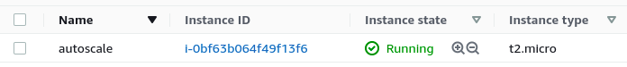
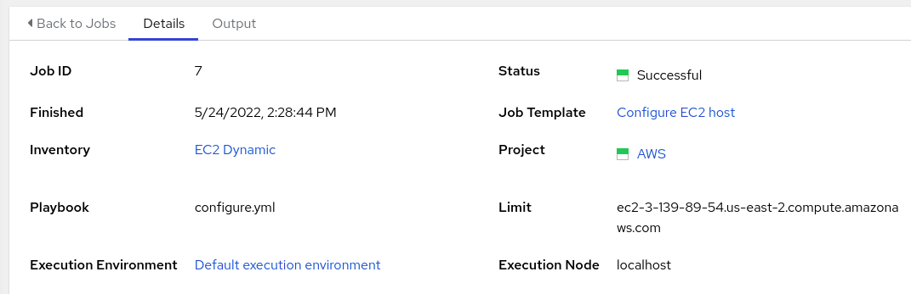

# Provisioning Callbacks with AWS Auto Scaling

## Problem

Cloud providers like AWS all offer auto scaling capability. It's a major reason why organizations want to be in the cloud in the first place - having the agility to scale up and down as demand dictates.

To get into an example specific to AWS: let's say that an [Auto Scaling](https://aws.amazon.com/autoscaling/) group kicks off the creation of a new Linux EC2 instance. That new instance is going to have to meet certain requirements before it can participate in hosting the application - possibly beyond what's been baked into the AMI being used. This is where Ansible comes in.

## Approach

Agility being the name of the game here, let's say that our application configuration is being managed as an Ansible playbook, so that developers can quickly and easily adjust it. We'll need to kick off Ansible to configure this new host, and we'll need that to happen all on its own.

To do that, we'll use an Ansible Automation Controller feature called [Provisioning Callbacks](https://docs.ansible.com/automation-controller/latest/html/userguide/job_templates.html#provisioning-callbacks).

## Controller Setup

### Inventory

For this to work, we'll need to use dynamic inventory. Automation Controller has a built-in way to do dynamic inventory with AWS EC2, but I always prefer to build a YAML inventory file, which gives me more control over my inventory.

In this example, my YAML inventory file looks like this:

```
---
plugin: amazon.aws.aws_ec2
regions:
  - us-east-2
filters:
  tag:Name: autoscale
```

Here I'm calling the `aws_ec2` inventory plugin from the certified `amazon.aws` collection, telling it to look for instances in `us-east-2`, and to only give me instances with the `Name` tag set to `autoscale`. We'll use that later when we set up Auto Scaling.

In Automation Controller, I source this file from Git in my (otherwise blank) inventory, and attach a credential for the AWS API.


Critically, I have checked the **Overwrite** and **Update on launch** options. **Overwrite** will ensure that each time I sync this inventory source, Automation Controller will remove any host locally that no longer exists in AWS. That's important because we expect instances to come and go in an Auto Scaling group. **Update on launch** will ensure that any time a job launches using this inventory, it will update the inventory source before launching it. That's important because when a new instance comes up and requests provisioning, it will need to exist in the inventory first.

### Job Template

The standard things you expect in a Job Template apply here: match the dynamic inventory from above to a playbook that does the application provisioning and a Machine credential that's able to connect to new instances. What's unique is that I am going to check the **Provisioning Callbacks** box at the bottom of the template editor:


There's a prompt for a **Host Config Key**.  This will effectively be the password used to authenticate with the Automation Controller API (though it's worth noting that it's a very limited authentication, only good for kicking off provisioning jobs against this template).

After saving the template, the **Provisioning Callback URL** is displayed. Some implementations need the whole URL, but the way I'm doing it, I just need the base URL of the Controller and the Job Template ID. My full URL was `https://ec2-3-18-214-117.us-east-2.compute.amazonaws.com/api/v2/job_templates/10/callback/` so I'm just going to note a base URL of `https://ec2-3-18-214-117.us-east-2.compute.amazonaws.com` and a Job Template ID of  `10`.

## AWS Setup

### Launch Configuration

The Auto Scaling Group will need a Launch Configuration, so I'll make that first. Here I'll use the **User Data** field (under **Advanced Details**) to embed a short bash script that will reach out to Automation Controller when a new instance first spins up.

There are many ways you could accomplish this. The way I'm choosing to do it makes use of a pre-created bash script that ships with Automation Controller. This script is available on the Controller server at `/usr/share/awx/request_tower_configuration.sh` (and there is also a `request_tower_configuration.ps1` PowerShell version for use with Windows). You can take this script and host it anywhere you'd like, as long as a new EC2 instance can access it. For me, I want to get it from somewhere public, so I'm going to get it from Automation Controller's upstream AWX project on GitHub.

My User Data bash script will basically be a wrapper around `request_tower_configuration.sh` to get the script downloaded and run it:

```
#!/bin/bash
curl https://raw.githubusercontent.com/ansible/awx/20.1.0/tools/scripts/request_tower_configuration.sh --output /root/request_tower_configuration.sh
chmod +x /root/request_tower_configuration.sh
/root/request_tower_configuration.sh -s https://ec2-3-18-214-117.us-east-2.compute.amazonaws.com -c myverycomplexkey -t 10 -k
```

Note above that I have plugged in the Controller base URL, the Job Template ID, and the Host Config Key on the final line. The `-k` flag disables SSL verification since this is a lab environment.

Apart from this, I'm going to use a basic RHEL AMI so that I can later prove that Ansible has configured it.

### Auto Scaling Group

When creating my Auto Scaling group, there's two things to dial in. First, attach the Launch Configuration we just looked at. Then, recall that our dynamic inventory expects a `Name` tag value of `autoscale`, so we apply that to all new instances.


## Results

For the sake of demonstration, I'm going to go into my Auto Scaling group and set the Desired capacity to 1. We see a new instance come up and can visually see the Name tag has been applied:



Now we can monitor the Jobs list in Automation Controller. Some time shortly after the new EC2 instance comes up, we see a couple of jobs start:


The first one is an **Inventory Sync**, which happened because we enabled **Update on launch** within the Inventory Source. This added the new EC2 instance to our inventory. The second one is a **Playbook Run** which is doing the work of configuring the new instance.

We can see that a **limit** was applied for us, causing the job to only run against the new host, even though the template would not ordinarily prompt for a limit:



At this point our host is provisioned with all the changes defined in the application config playbook. Going forward, each new instance that comes up in this Auto Scaling Group will register/provision itself, and stale instances will remove themselves.
