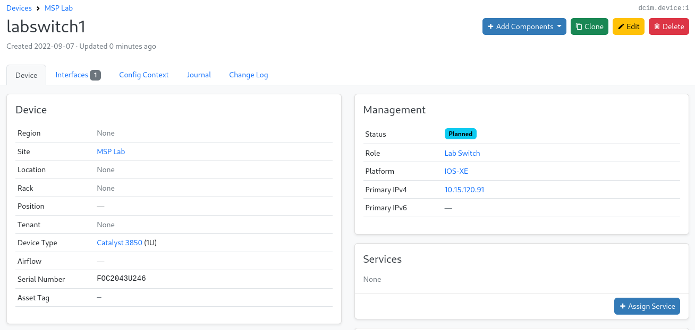

# Zero-touch Provisioning (ZTP) with Cisco IOS-XE and Netbox

## Problem

In an organization without automation, provisioning new network gear for a new site coming online (or an infrastructure refresh at an exsiting one) might look something like this:

1. Order the equipment and wait for fulfillment
2. Engineering staff recieve the equipment at a staging location
3. Engineering staff configure the equipment by hand
4. Engineering staff test that the configured equipment is working correctly
5. Engineering staff re-package the equipment and ship it out to the site
6. Site staff recieve the equipment and rack/cable it
7. Site and engineering staff together verify that the configured equipment is working correctly and cut over to it

Steps 2-5 don't need to happen! If we can get rid of them, that accomplishes a couple things:
* Greatly improves the speed at which new sites can come online (or equipment refreshes can be accomplished)
* Frees up engineering staff to do work that's more strategic than spending all day typing away at a serial console

## Approach

Cisco IOS-XE is capable of a few different ways of doing [Day Zero provisioning](https://developer.cisco.com/docs/ios-xe/#!day-zero-provisioning-quick-start-guide), but here I will be covering the Zero Touch Provisioning (ZTP) option.

ZTP makes use of the [Guest Shell](https://www.cisco.com/c/en/us/td/docs/ios-xml/ios/prog/configuration/166/b_166_programmability_cg/guest_shell.html) in IOS-XE 16.6.x and above. Guest Shell is a Linux container that runs locally on the network device, and it's capable of running Python scripts.

The rest of this blog will be an example I developed of how to combine Ansible Automation Platform with this IOS-XE ZTP process.

This is the overall sequence of events we want to happen:

1. Device boots without any startup configuration and tries to get a DHCP address
2. Device gets a DHCP offer containing Option 67 data, which is the location of a Python script available over HTTP
3. Device downloads and executes the specified script locally
4. The script applies a minimum configuration on the device, and issues an API call to Ansible Automation Controller requesting further configuration
5. An Ansible playbook runs on the Controller, reaching out to the device to apply the majority of its configuration

For all that to happen, Ansible Automation Controller needs to know in advance about the devices that may be coming online so that it can configure them correctly. There are multiple ways to approach that problem, but the way I'll be doing it here is via the use of a **CMDB** (Configuration Management Database).

I'll specifically be using [Netbox](https://docs.netbox.dev/en/stable/). Netbox is open-source, and it's a network-specific CMDB, so it has all the right options for defining network device details. The same level of functionality might require a good amount of customization in a more generic CMDB product.

## Netbox

### Setup

Netbox is going to serve as both our CMDB (for asset tracking) and our IPAM (for management networking) in this example.

We need to store the following information for each device to be provisioned:
* Name
* Serial number
* Management IP address
* Management interface
* Install status

There are a few parts to configuring a new device in Netbox. We'll start with the Device object:



Here we have covered the Name, Serial, and Status requirements. I want to point out the "Lab Switch" Role that's assigned here too, which we'll use later. We've also added an Interface to the Device:


Note the "Management Only" box being checked - that will be used to identify the management interface. There is also an IP Address added to the Interface:


This covers the management IP address and interface requirements.

### Dynamic Inventory

Now we need Ansible to be able to access this information. We can do that using the Netbox [Dynamic Inventory plugin `netbox.netbox.nb_inventory`](https://docs.ansible.com/ansible/latest/collections/netbox/netbox/nb_inventory_inventory.html) from the [`netbox.netbox` Collection](https://galaxy.ansible.com/netbox/netbox).

I'm using the following YAML inventory to query Netbox:

```yaml
---
plugin: netbox.netbox.nb_inventory
validate_certs: false
interfaces: true
compose:
  serial: serial
  ansible_network_os: platform.slug
group_by: platforms
query_filters:
  - status: planned
  - platform: ios
```

Here are each of the options I'm using and why:
* `plugin` - Required fully-qualified name of the plugin I want to use
* `validate_certs` - This is a lab and I don't want SSL failure from self-signed certificates
* `interfaces` - Tell the plugin to include interface information for the devices, which it doesn't do by default
* `compose` - The plugin doesn't include serial information by default, so I'm forcing it to. I'm also taking the platform slug (here that will be `ios`) and setting it as the `ansible_network_os` value
* `group_by` - Puts the returned devices into a group, in this case that will be `platforms_ios`
* `query_filters` - Only return IOS devices which are in "Planned" status

I'm using the environment variables `NETBOX_API` and `NETBOX_TOKEN` for authentication, so those don't appear in the file.

This makes all of the required information available to Ansible, albeit with some processing still needed.

## ZTP Setup

There are some things we need to put in place to get ZTP to work. We'll need DHCP set up correctly, and we'll some files available over HTTP (a Python script and any data it will need to access).

### DHCP

Any DHCP server that can set Option 67 (Bootfile Name) will work for this. I'm using [`dhcp-server` on RHEL](https://access.redhat.com/documentation/en-us/red_hat_enterprise_linux/9/html/managing_networking_infrastructure_services/providing-dhcp-services_networking-infrastructure-services).

The important line in my `/etc/dhcp/dhcpd.conf` file looks like:
```
option bootfile-name "http://webserver.example.com/ztp.py";
```

### Python script

Let's start by determining what needs to be in this script:
* Management networking details (static address, interface) for any devices that may need configuring
* Credentials to set for Ansible to connect to the device
* What API call to make to kick off the configuration process

Since this is the kind of information that could change over time, I'm going to use Ansible to gather and set this information in the script dynamically.

### Web server

Any web server will do. I'm using [Apache (`httpd`) on RHEL](https://access.redhat.com/documentation/en-us/red_hat_enterprise_linux/9/html/deploying_web_servers_and_reverse_proxies/setting-apache-http-server_deploying-web-servers-and-reverse-proxies).

For this use case, I want Ansible to generate the content being served by the web server. Let's take a look at how to do that, using the inventory data we got from Netbox.

The files I want to serve are:
* The ZTP Python script
* A JSON file containing common information about the Ansible Automation Controller
* A JSON file for each device to be provisioned, containing management information

Below is a playbook to set that up:

```yaml
---
- name: Prepare web server
  hosts: platforms_ios
  gather_facts: no

  vars:
    public_key: ssh-rsa AAAAB3NzaC1yc2EAAAADAQABA[...]
    controller_address: controller.example.com
    controller_token: test123
    controller_template: 23
    web_dir: /var/www/html

  tasks:
    - name: Make Python script
      ansible.builtin.template:
        src: ztp.py.j2
        dest: "{{ web_dir }}/ztp.py"
      run_once: yes
      delegate_to: web

    - name: Make controller JSON file
      ansible.builtin.template:
        src: controller.json.j2
        dest: "{{ web_dir }}/controller.json"
      run_once: yes
      delegate_to: web

    - name: Make device JSON files
      ansible.builtin.template:
        src: device_serial.json.j2
        dest: "{{ web_dir }}/device_{{ serial }}.json"
      delegate_to: web
```

I also need a simple static inventory that tells Ansible about my web server:

```yaml
---
all:
  hosts:
    web:
      ansible_host: 10.15.120.99
```

Ansible can run a playbook with multiple inventory sources, so when I run this playbook I'll run it with both this inventory as well as the Netbox inventory together.

This will template out all the files needed. The playbook itself is simple; the complex part is in the Jinja2 template files.

#### The Controller Information JSON template

```jinja
{# Isolate and split the public key data into 100-char lines #}

{# Set up the JSON data #}

{# Dump contents #}
{{ json_data | to_nice_json }}
```

This is taking data that was provided in the `vars` block of the template and forming a JSON file of common data that will be needed to request configuration from the Ansible Automation Controller.

Of note here is the public key data - to install an SSH public key on a Cisco device, you have to stay under the limit for a single config line, meaning that a modern SSH key has to be split into multiple lines. We'll have the Python script worry about how to apply that correctly; for now we're just going to have Ansible do the splitting and save the result as a list.

My resulting `controller.json` file looks like:

```json
{
    "controller_address": "controller.example.com",
    "controller_template": 23,
    "controller_token": "test123",
    "public_key": [
        "AAAAB3NzaC1yc2EAAAADAQABAAACAQDNZcrJnihIQ8LGC2IFIgmunCPamX7VcEWSH94rzd/r6Otnd6u8Psuc1dqWcl0QWnm89hlV",
        "QUDMifockXYRs6e6kc8bc+kK353wYJSBNu8UVHhL0Zgnw0fmlZHpAiu51P+H1voOycMxR3VZBZJ6gt7KWNGPO1GupOPvLrP7+mjV",
        [...]
    ],
    "valid_serials": [
        "FOC2043U246"
    ]
}

```

#### The Device Information JSON template

```jinja
{# Get the first interface marked as Management Only #}

{# Get the first (should be only) IP address associated with the above interface #}

{# Set up the JSON data #}

{# Dump contents #}
{{ json_data | to_nice_json }}
```

This is parsing through the complex data structures returned by Netbox, doing some transformation/filtering on that data, and boiling everything down to a nice flat JSON dictionary for us to use later.

Worth mentioning is that there is some work being done by the [`ansible.utils.ipaddr` filter](https://docs.ansible.com/ansible/latest/collections/ansible/utils/docsite/filters_ipaddr.html). The value of `ip_address_data.address` is `10.15.120.91/22`, which is good information, but it's not in the form we need.
* `ipaddr('address')` gives us just the address part.
* `ipaddr('netmask')` gives us just the netmask part, and we have converted from CIDR notation since that's what IOS will want.
* `ipaddr('-2')` gives us the last usable address in the range, which follows an assumption I'm making that this will be the gateway address.

My resulting `device_FOC2043U246.json` looks like:

```json
{
    "mgmt_address": "10.15.120.91",
    "mgmt_gateway": "10.15.123.254",
    "mgmt_interface": "GigabitEthernet0/0",
    "mgmt_netmask": "255.255.252.0"
}
```

### The Python script template

This is mostly a static Python script. The only thing being templated is the address of the web server according to the static inventory from earlier.

```python
import cli
import urllib2
import re
import ssl
import json
from xml.dom import minidom

WEB_SERVER = "{{ hostvars['web']['ansible_host'] }}"

def get_serials():
    inventory = cli.cli('show inventory | format').strip()
    document = minidom.parseString(inventory)
    serials = list()
    for entry in document.getElementsByTagName('InventoryEntry'):
        chassis = entry.getElementsByTagName('ChassisName')[0]
        name = chassis.firstChild.data
        if name == "Chassis" or re.match('"Switch ([0-9])"', name):
            serials.append(entry.getElementsByTagName('SN')[0].firstChild.data)
    print('ANSIBLE ZTP: Discovered serials {}'.format(','.join(serials)))
    return serials

def get_remote_data(file_name):
    get_url = 'http://{}/{}'.format(WEB_SERVER, file_name)
    response = urllib2.urlopen(get_url)
    r_data = json.load(response)
    return r_data

def configure_management(device_data, public_key):
    print('ANSIBLE ZTP: Configuring management')
    cli.configure(['interface {}'.format(device_data['mgmt_interface']), 'ip address {} {}'.format(device_data['mgmt_address'], device_data['mgmt_netmask'])])
    cli.configure('ip route vrf Mgmt-vrf 0.0.0.0 0.0.0.0 {}'.format(device_data['mgmt_gateway']))
    cli.configure('username ansible privilege 15')
    cli.configure(['ip ssh pubkey-chain', 'username ansible', 'key-string'] + public_key + ['exit'])
    cli.configure(['line vty 0 4', 'login local'])

def call_controller(controller_data, serial):
    headers = {"Content-Type": "application/json"}
    data = {"host_config_key": controller_data['controller_token']}
    launch_url = 'https://{}/api/v2/job_templates/{}/callback/'.format(controller_data['controller_address'], controller_data['controller_template'])
    print('ANSIBLE ZTP: Contacting Ansible Controller API at {}'.format(launch_url))
    request = urllib2.Request(launch_url, data=json.dumps(data), headers=headers)
    response = urllib2.urlopen(request, context=ssl._create_unverified_context())
    api_node = response.info()['X-API-Node']
    api_location = response.info()['location']
    print('ANSIBLE ZTP: Initiated job at {}{}'.format(api_node, api_location))

def main():
    print('\nANSIBLE ZTP: Starting')
    controller_data = get_remote_data('controller.json')
    serials = get_serials()
    for serial in serials:
        if serial in controller_data['valid_serials']:
            print('ANSIBLE ZTP: Serial {} was found within known data; proceeding'.format(serial))
            device_data = get_remote_data('device_{}.json'.format(serial))
            configure_management(device_data, controller_data['public_key'])
            call_controller(controller_data, serial)
            break
        else:
            print('ANSIBLE ZTP: Serial {} was not found within known data; skipping'.format(serial))

if __name__ == "__main__":
    main()

```

In order, here's what this does:
1. Load the Controller Information dictionary (`controller.json`) from the web server
2. Discover all the serials present on the switch (keeping in mind that it may be a stack of switches, though in this example it's not)
3. Loop through the serials, and only proceed when one is found that matches a serial in our Netbox inventory. The script will only run against the first matching serial.
4. Load the Device Information dictionary (`device_<serial>.json`) from the web server
5. Apply the minimum configuration to the device (management interface address, local Ansible user, SSH key)
6. Call out to Ansible Automation Controller for further configuration

Python developers looking at this will notice that I'm using `urllib2` to make HTTP calls, which is quite old. The issue we face here is that older versions of IOS-XE have old Python environments. While I would like to use the simpler and more modern `requests` library, I can't expect it to be available on the device being provisioned. Even though it's likely that a device running old code will get upgraded as part of the install, if you want to do that via automation (you do!), you still have to get this part done first. In a situation where I can make the assumption of the device shipping with newer code, this script could be updated.

Also of note is the `cli` library, which is unique to the Cisco Guest Shell environment, and allows direct configuration of the device via Python.
